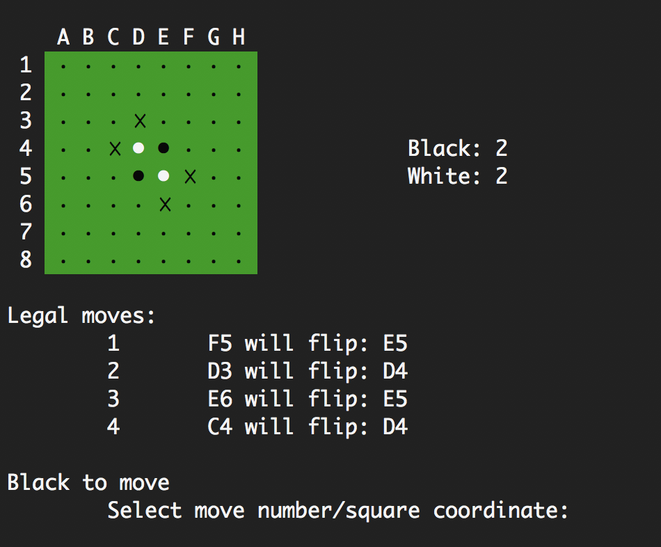

# Otto - an Othello AI!

Otto is an Othello/Reversi game-playing artificial intelligence that implements
a straightforward minimax search with alpha-beta pruning.

## Requirements
* A terminal that supports
  - Unicode
  - xterm-256-color
* g++ or another C++ compiler
* UNIX `make` utility (recommended, but not required)

In a supported terminal, the command prompt should look like this:



## Installation and Usage
Using git:

```
$ git clone https://github.com/eigenfoo/otto-othello.git
$ cd otto-othello
$ make
$ ./othello.exe
```

Alternatively, you can download the `.zip` file from
[my GitHub repository](https://github.com/eigenfoo/othello) and compile it
manually using your preferred C++ compiler.

## Details

### Save Files
  - There is the option to load a saved board at the start of a game.
  - The first 8 rows of the save file represent the state of the board.
    - _Spacing is important_: each line must not begin with a space, but each
      number must be separated by a single space, and there must not be any
      trailing spaces.
  - 0, 1, and 2 represent an emtpy square, a black disc, and a white disc,
    respectively.
  - The numbers in the final two rows represent whose turn it is (1 for black or
    2 for white), and the time limit (for any turn played by the computer).
  - Several example board text files are included under the `test/` directory.

### AI Algorithm
The search algorithm is a vanilla minimax search with iterative deepening
depth-first search and alpha-beta pruning.

In the opening, the AI may take its moves from a database of commonly
played openings (sources [here](http://www.othello.nl/content/anim/openings.txt)
and [here](http://www.samsoft.org.uk/reversi/openings.htm)). If the sequence of
moves is not found in the database, the AI resorts to its search algorithm.

Near the endgame, the AI conducts a complete search of the remainder of the
game tree, searching down to the terminal states instead of using heuristic
evaluations of earlier cutoff states.

### Heuristic Function
One of the most critical components of the search algorithm is the heuristic
function, which evaluates the strength and overall desireability of a given
board position. It is implemented as a linear combination of the following
statistics, with the weights adapting as the game progresses:

  - Corners (Measures control of the corners. Weighted highly at all times.)
  - Stability (Measures the number of discs that cannot be flipped for the rest
    of the game. For performance reasons, only a lower bound on the number of
    stable discs is computed. Weighted highly at all times.)
  - Parity (Measures who is expected to make the last move/ply of the game.
    Has zero weight in the opening, but increases to a very large weight in
    the midgame and endgame.)
  - Disc difference (Measures the difference in the number of discs on the
    board. Has zero weight in the opening, but increases to a moderate weight in
    the midgame, and to a significant weight in the endgame.)
  - Mobility (Measures the number of moves the player is currently able to
    make. Has significant weight in the opening game, but diminishes to zero
    weight towards the endgame.)
  - Potential mobility (Measures the number of moves that the player will be
    able to make. Weighted identically to mobility.)
  - Square weights (Assigns weights to squares so as to avoid giving the
    opponent a corner. Has moderate weight in the opening and midgame, but has
    no weight in the endgame.)
